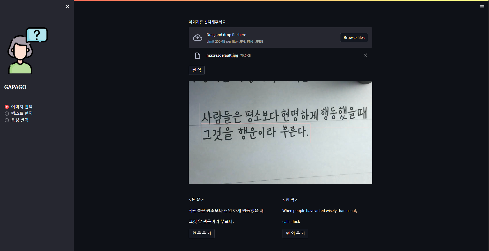
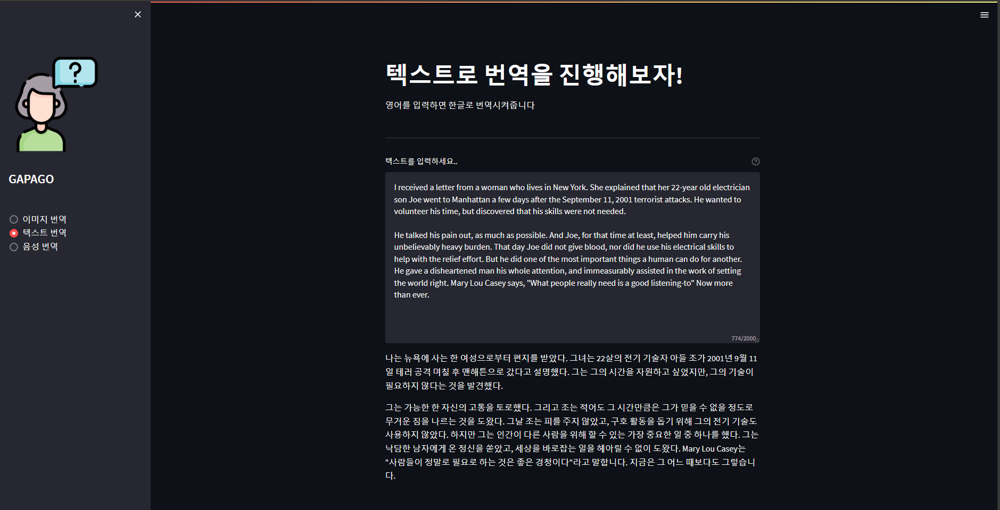
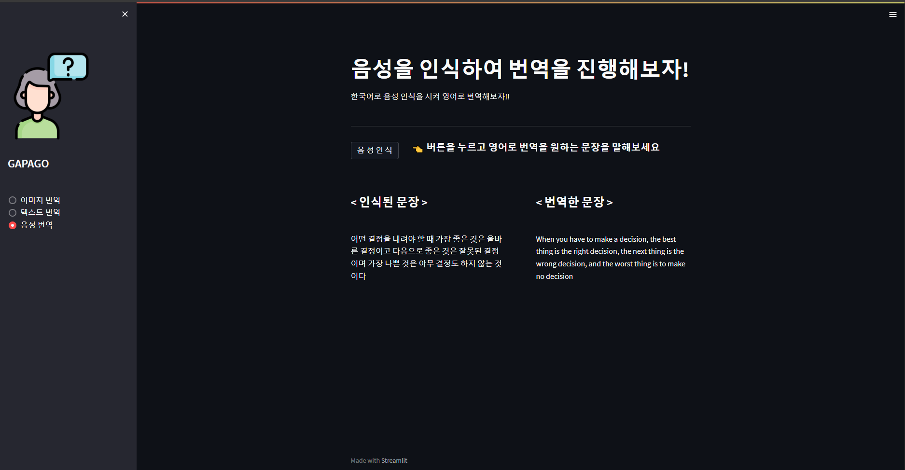

# Gapago

> 본 서비스는 "서울ICT이노베이션스퀘어_고급언어인지과정_3기" 수업과정 중 제출한 과제물 입니다
---

## 서비스 설명
streamlit을 활용한 세가지 버젼의 번역 사이트를 만들었습니다

1. **이미지 번역**

easyocr을 활용하여 이미지 파일을 업로드 하면 해당 이미지의 텍스트를 분석해 box가 추가된 이미지가 결과로 나오게 됩니다.
이후 인식한 텍스트와 이를 번역한 텍스트가 나오고 하단의 버튼을 통해 **tts(text-to-speaking)** 서비스를 동시에 받을 수 있습니다.  
easyocr 깃허브 : https://github.com/JaidedAI/EasyOCR
  
  
  
2. **텍스트 번역**

PAPAGO API와 Googletrans API를 사용하여 한글을 입력하면 해당 텍스트에 대한 번역 결과를 출력해주는 번역 서비스 입니다.
  
  
  
3. **음성 번역**

버튼을 누르고 번역을 원하는 음성을 말하면 해당 음성을 인식해 한글->영문으로 번역을 진행하고 해당 결과의 tts 서비스를 받을 수 있습니다. 
  
  
  
---
  
### 개발기간
2022/08/17 ~ 2022/08/30 (2주)
